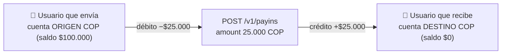
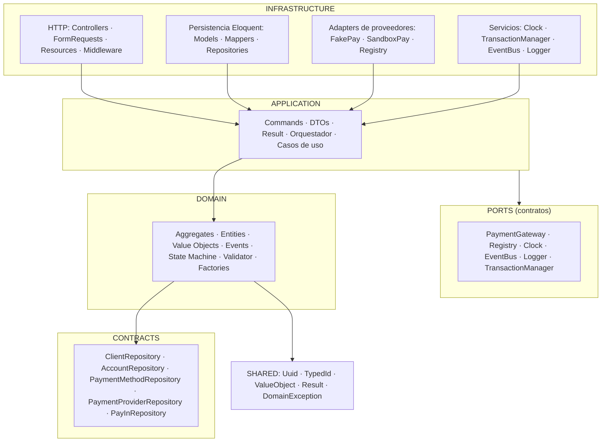
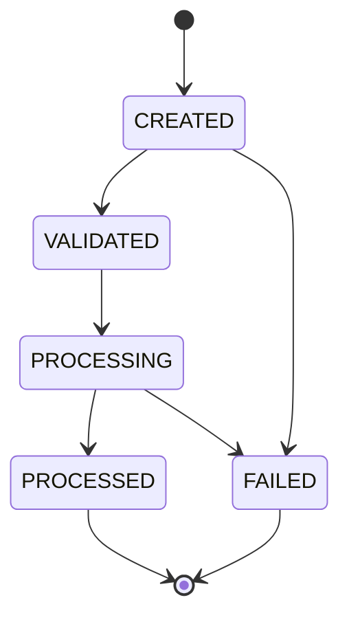

# PayIn Platform

Componente **PayIn** para plataformas financieras: procesamiento transaccional de ingresos de fondos construido con **PHP 8.3**, **Laravel 11**, **Domain-Driven Design** y **Arquitectura Hexagonal (Ports & Adapters)**.

> Diseñado para demostrar calidad de ingeniería empresarial: dominio 100% independiente del framework, proveedores de pago intercambiables sin tocar una sola clase del dominio, y una API versionada, documentada y testeada.

---

## Tabla de contenidos

1. [Cómo probar en 5 minutos](#1-cómo-probar-en-5-minutos)
2. [Casos de uso](#2-casos-de-uso)
3. [Arquitectura implementada](#3-arquitectura-implementada)
4. [Decisiones técnicas](#4-decisiones-técnicas)
5. [Patrones de diseño utilizados](#5-patrones-de-diseño-utilizados)
6. [Principios SOLID aplicados](#6-principios-solid-aplicados)
7. [Estructura del proyecto](#7-estructura-del-proyecto)
8. [Modelo del dominio](#8-modelo-del-dominio)
9. [Endpoints](#9-endpoints)
10. [Cómo ejecutar el proyecto](#10-cómo-ejecutar-el-proyecto)
11. [Cómo ejecutar pruebas y calidad](#11-cómo-ejecutar-pruebas-y-calidad)
12. [Cómo agregar un nuevo proveedor](#12-cómo-agregar-un-nuevo-proveedor)
13. [Cómo agregar un nuevo método de pago](#13-cómo-agregar-un-nuevo-método-de-pago)
14. [Seguridad](#14-seguridad)
15. [Riesgos identificados](#15-riesgos-identificados)
16. [Suposiciones realizadas](#16-suposiciones-realizadas)
17. [Posibles mejoras futuras](#17-posibles-mejoras-futuras)

---

## 1. Cómo probar en 5 minutos

¿Quieres ver el componente funcionando sin leer el resto? Sigue estos pasos:

```bash
# 1. Levanta el stack (php-fpm, nginx, mysql, redis)
docker compose up -d

# 2. Crea el archivo .env a partir del ejemplo (¡necesario para arrancar!)
Copy-Item .env.example .env

# 3. Genera la clave de la aplicación
docker compose run --rm php php artisan key:generate

# 4. Instala dependencias
#    (en Windows la extracción de paquetes es lenta: desactiva el timeout)
docker compose run --rm -e COMPOSER_PROCESS_TIMEOUT=0 php composer install --no-interaction

# 5. Crea la base de datos y siembra los datos de demo
docker compose run --rm php php artisan migrate:fresh --seed

# 6. Genera la documentación Swagger
docker compose run --rm php php artisan l5-swagger:generate

# 7. ¡Listo! Abre la documentación interactiva:
#    http://localhost:8080/api/documentation
```

### Los datos que ya existen en la base (cópialos tal cual)

Los **IDs son fijos** y coinciden con los ejemplos de Swagger, así que puedes usar **"Try it out" sin editar nada**:

| Rol | Campo del JSON | ID (cópialo) |
|---|---|---|
| **Usuario que envía dinero** (cliente) | `client_id` | `019fd715-ebf8-7223-ada8-b3c168a28e22` |
| **Usuario que envía dinero** (cuenta ORIGEN, se debita) | `origin_account_id` | `019fd715-ec1a-7a7e-ab6f-f497aa52abe4` |
| **Usuario que recibe** (cuenta DESTINO, se acredita) | `account_id` | `019fd715-ec22-700c-8cba-ea026d0fd9a9` |
| Método de pago: **tarjeta** (proveedor FakePay) | `payment_method_id` | `019fd715-ec43-784b-97dd-9b2fe70bfe69` |
| Método de pago: **PSE** (proveedor SandboxPay) | `payment_method_id` | `019fd715-ec50-7000-8000-000000000001` |
| Método de pago: **Wallet** (proveedor SandboxPay) | `payment_method_id` | `019fd715-ec51-7000-8000-000000000002` |
| Método de pago: **Efectivo / `cash`** (éxito inmediato) | `payment_method_id` | `019fd715-ec52-7000-8000-000000000003` |

### Cómo fluye el dinero



### El JSON para transferir dinero

En Swagger, abre **`POST /api/v1/payins`** → clic en **"Try it out"** → pega esto → **"Execute"**:

```json
{
  "client_id": "019fd715-ebf8-7223-ada8-b3c168a28e22",
  "origin_account_id": "019fd715-ec1a-7a7e-ab6f-f497aa52abe4",
  "account_id": "019fd715-ec22-700c-8cba-ea026d0fd9a9",
  "payment_method_id": "019fd715-ec43-784b-97dd-9b2fe70bfe69",
  "amount": 25000,
  "currency": "COP",
  "reference": "order-2026-0001"
}
```

**Qué debe pasar (y cómo comprobarlo):**

1. La respuesta es `201 Created` con `"status": "processed"` y un `"id"`.
2. **El saldo del que envía baja:** `GET /api/v1/accounts/019fd715-ec1a-7a7e-ab6f-f497aa52abe4` → `"balance": 75000`.
3. **El saldo del que recibe sube:** `GET /api/v1/accounts/019fd715-ec22-700c-8cba-ea026d0fd9a9` → `"balance": 25000`.
4. En el extracto de cada cuenta ves el débito/crédito: `GET /api/v1/accounts/{id}/movements`.

> Es como dar un billete: al que envía se le descuentan $25.000 y al que recibe se le acreditan $25.000, y la plataforma deja constancia de todo (transacción + movimientos del libro mayor).

Todos los escenarios de prueba están en la siguiente sección, y los mismos IDs de prueba están dentro de Swagger en la cabecera de la página.

---

## 2. Casos de uso

Cada caso te dice **qué petición hacer** y **qué respuesta esperar**. Montos en **unidades menores** (cents): `25000` COP = `$250,00`.

### UC-1 — Transferencia exitosa (usuario que envía → usuario que recibe) (`processed`)

- **Endpoint:** `POST /api/v1/payins` (body: el JSON de la sección 1, `amount: 25000`).
- **Respuesta:** `201 Created`, `"status": "processed"`, `"provider_transaction_id": "FP-..."`, `"error_code": null`.
- **Verifica:**
  - Usuario que envía: `GET /api/v1/accounts/019fd715-ec1a-7a7e-ab6f-f497aa52abe4` → `"balance": 75000` (bajó).
  - Usuario que recibe: `GET /api/v1/accounts/019fd715-ec22-700c-8cba-ea026d0fd9a9` → `"balance": 25000` (subió).

### UC-2 — Saldo insuficiente (`422`)

- **Endpoint:** `POST /api/v1/payins` con `"amount": 999999999` (más de lo que tiene el que envía).
- **Respuesta:** `422 Unprocessable Entity`, `"errors[0].code": "INSUFFICIENT_FUNDS"`.
- **Verifica:** ninguna cuenta cambia de saldo.

### UC-3 — PayIn rechazado por el proveedor (`failed`)

- **Paso previo:** en tu `.env` pon `PAYIN_FAKEPAY_BEHAVIOR=rejected`, reinicia el contenedor (`docker compose restart php`) y vuelve a generar (`php artisan l5-swagger:generate` no hace falta para esto).
- **Endpoint:** `POST /api/v1/payins` con la tarjeta Visa (`payment_method_id` de la tabla).
- **Respuesta:** `201 Created` (el PayIn **sí se crea**) pero `"status": "failed"` y `"error_code": "PROVIDER_REJECTED"`.
- **Verifica:** los saldos **no cambian** y `GET /api/v1/payins?status=failed` muestra el PayIn fallido.

### UC-4 — Referencia duplicada (`409`, idempotencia)

- Ejecuta el UC-1 dos veces con la **misma** `"reference"`.
- **2.ª ejecución → Respuesta:** `409 Conflict`, `"errors[0].code": "REFERENCE_ALREADY_USED"`.
- **Verifica:** no se descuenta ni se abona dos veces (protege de dobles cobros).

### UC-5 — Consultar una transacción por su `id`

- Copia el `"id"` devuelto por el UC-1 y llama a `GET /api/v1/payins/{id}`.
- **Respuesta:** `200 OK` con todos los campos del PayIn (monto, moneda, estado, referencias del proveedor, fechas).

### UC-6 — Consultar el extracto (movimientos) de una cuenta

- `GET /api/v1/accounts/019fd715-ec1a-7a7e-ab6f-f497aa52abe4/movements` → verás un movimiento `"type": "debit"`, `"amount": 25000`, `"balance_after": 75000` y el `"pay_in_id"` que lo originó.
- `GET /api/v1/accounts/019fd715-ec22-700c-8cba-ea026d0fd9a9/movements` → verás un movimiento `"type": "credit"`, `"amount": 25000`, `"balance_after": 25000`.

### UC-7 — Historial de transacciones de un cliente

- **Endpoint:** `GET /api/v1/payins?client_id=019fd715-ebf8-7223-ada8-b3c168a28e22` → historial del **usuario que envía** (todos sus PayIns, del más reciente al más antiguo).
- Prueba con el id del que recibe (`019fd715-ed01-7000-8000-000000000001`) → devuelve sus operaciones como pagador (vacío en la demo porque solo recibe).
- Para ver lo que **recibió** una cuenta (aunque el pagador sea otro), usa el extracto del **UC-6**.
- Combinable con estados: `?client_id={id}&status=processed`.

### UC-8 — Ver los estados por filtro

El PayIn recorre los estados `CREATED → VALIDATED → PROCESSING → PROCESSED/FAILED`. Los estados intermedios son **instantáneos** (la API es síncrona); lo que queda persistido es el estado final.

- `GET /api/v1/payins?status=processed` → los exitosos (UC-1).
- `GET /api/v1/payins?status=failed` → los fallidos (UC-3).
- `GET /api/v1/payins` → todos, con paginación (`limit`, `offset`).

---

## 3. Arquitectura implementada

**Arquitectura Hexagonal (Ports & Adapters)** con cuatro capas en `src/PayIn/` y namespace PSR-4 propio:



**Reglas de dependencia (una sola dirección):**

- `Infrastructure → Application → Domain → Shared`
- El **dominio no conoce Laravel** (ni Eloquent, ni Facades, ni config): puede reutilizarse fuera del framework. Verificado por PHPStan (nivel 9) y por diseño: `src/PayIn/Domain` solo importa `PayIn\Shared` y la librería `symfony/uid`.
- La aplicación define los **puertos** (interfaces) que la infraestructura implementa como **adapters**.
- Los **Controllers** y **Models Eloquent** contienen cero lógica de negocio.

Ver [docs/ARCHITECTURE.md](docs/ARCHITECTURE.md) para los diagramas de componentes, flujo, ER y secuencia.

## 4. Decisiones técnicas

| Decisión | Justificación |
|---|---|
| **Montos en unidades menores enteras** (`BIGINT` cents) | Evita errores de punto flotante en operaciones financieras; alineado con ISO 4217. El VO `Money` encapsula monto+moneda como indivisibles. |
| **UUID v7 para identificadores** (`symfony/uid`) | Ordenables cronológicamente → índices B-tree eficientes. IDs tipados por concepto (`ClientId`, `AccountId`, `TransactionId`...) para type-safety en compilación. |
| **Método de pago = instrumento independiente** | No pertenece a clientes ni cuentas: es un instrumento (tarjeta, PSE, wallet, efectivo). Un PayIn abona a **cualquier** cuenta destino sin validar pertenencia (Ana paga → el saldo de Pedro aumenta). |
| **Método de pago vinculado a su proveedor (`provider_id`)** | Estándar de industria: el token pertenece a la pasarela que lo tokenizó (el token de Wompi no es cobrable por PayU). El orquestador resuelve el gateway desde el método. |
| **Matriz de capacidades del proveedor (`supported_types`)** | El proveedor declara qué tipos puede procesar ("FakePay soporta card; SandboxPay soporta card/pse/wallet/bank_transfer; cash soporta cash"). Se valida al registrar el método y en cada PayIn (defensa). |
| **`cash` como proveedor simulado** | El pago en efectivo no requiere pasarela: `CashGateway` confirma al instante con el mismo contrato `PaymentGateway` — el orquestador permanece uniforme (sin condicionales). |
| **`transactions` como núcleo financiero reutilizable** | Un futuro `Payout`/`Refund` reutiliza la misma tabla sin tocar el dominio; `pay_ins` guarda solo lo específico (sin duplicación). |
| **Call al proveedor FUERA de la transacción** | Evita mantener locks de BD mientras el proveedor responde (latencia variable, timeouts). |
| **Locking optimista (`version` column, compare-and-set)** | El repositorio recuerda la versión cargada del aggregate y falla con `PAYIN_CONCURRENCY_CONFLICT` si otro proceso la modificó. El dominio permanece limpio (la versión es un concepto de persistencia). |
| **Idempotencia por `reference`** | La unicidad en BD + chequeo de aplicación previenen dobles cobros en reintentos (409 Conflict). |
| **Validación en dos frentes** | HTTP (`FormRequest`) para sintaxis/formatos + **Domain Service** (`PayInValidator`) para invariantes de negocio (moneda, método activo, proveedor activo, capacidades). Los datos inválidos nunca llegan al dominio. |
| **Regla `email` del framework NO utilizada** | Las versiones 11.x de Laravel presentan la vulnerabilidad CVE-2026-48019 (inyección CRLF en la regla de email) sin fix publicado; el dominio valida emails con su propio VO. Ver [Riesgos](#15-riesgos-identificados). |
| **Estado `PROCESSING` agregado** | El enunciado pide estados mínimos `CREATED/VALIDATED/PROCESSED/FAILED`; se agrega `PROCESSING` (operación en vuelo) porque el flujo async/colas lo exige. |
| **PHPUnit en lugar de Pest** | PHPUnit ya estaba instalado y locked; Pest no aporta valor diferencial suficiente para justificar el cambio de framework de testing. |
| **Logging estructurado** | Canal `payin` con contexto enriquecido (`payin_id`, `provider`, `outcome`, `latency_ms`, `correlation_id`); JSON formatter en producción. |
| **Correlación de peticiones** | Middleware `X-Correlation-Id` → traza completa request → orquestador → proveedor en los logs. |

## 5. Patrones de diseño utilizados

Cada patrón resuelve un problema real; no se incluyeron por demostración:

| Patrón | Ubicación | Problema que resuelve |
|---|---|---|
| **Ports & Adapters** | Toda la arquitectura | Desacoplar dominio/infraestructura; dominio reutilizable fuera de Laravel |
| **Repository** | `Domain/Contracts/*` ↔ `Infrastructure/.../Repositories/*` | Persistencia intercambiable sin acoplar el dominio |
| **Aggregate Factory** | `PayIn::create()` / `reconstitute()` | Construcción del aggregate con invariantes y eventos |
| **Strategy** | `PaymentGateway` + `FakePayProvider`/`SandboxPayProvider` | Algoritmos de cobro intercambiables por contrato |
| **Registry** | `ProviderRegistry` | Resolución de adapters por código de proveedor sin condicionales |
| **Adapter** | Cada proveedor | Absorbe la heterogeneidad de formatos/respuestas de cada pasarela |
| **State** | `PayInStatus` (enum con mapa de transiciones) + `transitionTo()` | Invariantes de transición; estados terminales; imposible saltar estados |
| **Result Pattern** | `Result`, `ChargeResult` | Errores como valores para resultados esperados (rechazo, timeout) |
| **Mapper** | `PayInMapper` y amigos | Traduce aggregates ↔ representación persistente (Eloquent nunca filtra al dominio) |
| **Command + DTO** | `ProcessPayInCommand`, `ChargeRequest` | Entrada inmutable, validada y tipada |
| **Domain Events** | `PayInCreated`...`PayInFailed` | Desacople del efecto secundario (logging) y habilitación de EDA futuro |
| **Unit of Work** | `TransactionManager` (port) | Atomicidad del caso de uso; el orquestador no conoce detalles de BD |
| **Dependency Injection** | `PayInServiceProvider` | Wiring centralizado de ports → adapters |

## 6. Principios SOLID aplicados

| Principio | Evidencia |
|---|---|
| **S**ingle Responsibility | `ProcessPayInService` orquesta; `PayInValidator` valida; `PayInMapper` mapea; `PayInEventLogger` observa; `PayInExceptionRenderer` traduce errores. Cada clase tiene una única razón de cambio. |
| **O**pen/Closed | Nuevos proveedores se agregan implementando `PaymentGateway` y registrándose en `config/payin.php` → `ProviderRegistry`. No existe ningún `if ($provider === ...)`. La máquina de estados se extiende en `PayInStatus` sin modificar el aggregate. |
| **L**iskov Substitution | `FakePayProvider` y `SandboxPayProvider` son sustituibles en el orquestador: mismo contrato, mismas garantías (nunca lanzan por respuestas de negocio). Verificado por test `test_same_contract_yields_normalized_result`. |
| **I**nterface Segregation | Puertos pequeños y específicos: `Clock`, `TransactionManager`, `EventBus`, `Logger`, `PaymentGateway`; los repositorios del dominio por aggregate (`ClientRepository` ≠ `PayInRepository`). |
| **D**ependency Inversion | El dominio define los contratos; la infraestructura los implementa y se inyecta vía constructor (`PayInServiceProvider`). El orquestador recibe puertos, nunca implementaciones concretas. |

## 7. Estructura del proyecto

```
├── src/PayIn/                       # Componente (namespace PSR-4 PayIn\)
│   ├── Domain/                      # ── Capa de dominio (sin Laravel) ──
│   │   ├── Client/                  #   Aggregate Client + ClientId
│   │   ├── Account/                 #   Aggregate Account + AccountId
│   │   ├── PaymentMethod/           #   Aggregate PaymentMethod + tipo
│   │   ├── PaymentProvider/         #   Aggregate PaymentProvider + ProviderCode
│   │   ├── PayIn/                   #   Aggregate PayIn, Transaction, PayInStatus
│   │   │   └── Events/              #   PayInCreated/Validated/Processing/Processed/Failed
│   │   ├── Contracts/               #   Repositorios + PayInSearchCriteria
│   │   └── Exceptions/              #   Jerarquía de excepciones del dominio
│   │   ├── Money.php · Currency.php · Email.php
│   ├── Application/                 # ── Capa de aplicación ──
│   │   ├── Command/                 #   ProcessPayInCommand
│   │   ├── Dto/                     #   ChargeRequest, ProcessPayInResponse, PayInPage...
│   │   ├── UseCase/                 #   ProcessPayInService (Orquestador), Query, List
│   │   ├── Port/                    #   Clock, TransactionManager, EventBus, Logger, PaymentGateway, Registry
│   │   ├── Result/                  #   ChargeResult, ChargeOutcome
│   │   └── Exception/               #   Not founds, idempotencia, concurrencia, procesamiento
│   ├── Infrastructure/              # ── Capa de infraestructura (Laravel) ──
│   │   ├── Persistence/Eloquent/    #   Models, Mappers, Repositories, Factories
│   │   ├── PaymentProviders/        #   FakePayProvider, SandboxPayProvider, ProviderRegistry
│   │   ├── Http/                    #   Api/V1/Controllers, FormRequests, Resources, Middleware, Exceptions, OpenApi
│   │   ├── Observers/               #   PayInEventLogger
│   │   ├── Services/                #   SystemClock, LaravelTransactionManager, LaravelEventBus, LaravelLogger
│   │   └── Providers/               #   PayInServiceProvider (wiring)
│   └── Shared/                      # ── Kernel compartido ──
│       ├── Uuid/                    #   Uuid (v7), TypedId
│       └── Kernel/                  #   ValueObject, DomainEvent, Result/Error, DomainException
├── app/                             # Skeleton Laravel (HTTP base)
├── bootstrap/app.php                # Routing + middleware + excepciones
├── config/payin.php                 # Configuración del componente
├── config/l5-swagger.php            # Documentación OpenAPI
├── database/
│   ├── migrations/                  # Migraciones normalizadas (fuente de verdad)
│   ├── sql/                         # Scripts SQL de referencia (schema.sql + seed.sql)
│   └── seeders/                     # PaymentProviderSeeder + DemoSeeder
├── docker/                          # Dockerfile multi-stage + nginx + php.ini
├── docker-compose.yml               # php-fpm · nginx · mysql:8 · redis
├── tests/
│   ├── Unit/PayIn/                  # Dominio + Aplicación + Adapters
│   ├── Repositories/PayIn/          # Persistencia (SQLite :memory:)
│   ├── Feature/PayIn/               # API end-to-end
│   └── Support/                     # PayInFixtures
├── pint.json · phpstan.neon · .editorconfig
```

## 8. Modelo del dominio

**Aggregates y reglas clave:**

| Aggregate | Estado | Reglas clave |
|---|---|---|
| `Client` | id, nombre, email | email validado y normalizado |
| `Account` | id, clientId, moneda, saldo | saldo en cents; `credit()` sólo en su moneda; destino de fondos de cualquier PayIn (sin pertenencia) |
| `PaymentMethod` | id, providerId, tipo, token, activo | **instrumento independiente** (sin cliente ni cuenta); token opaco del proveedor (nunca PAN); `UNIQUE(provider_id, token)` |
| `PaymentProvider` | id, code, nombre, activo, `supported_types` | catálogo persistido con **matriz de capacidades**; clave de resolución del Registry |
| `PayIn` | compone `Transaction` + accountId (destino) + paymentMethodId + fees | **máquina de estados**: ver abajo |

**Máquina de estados (Patrón State):**



Cada estado declara sus transiciones permitidas en `PayInStatus::transitions()`; cualquier transición inválida lanza `InvalidStateTransitionException` (409 en la API).

## 9. Endpoints

| Método | Ruta | Descripción |
|---|---|---|
| `POST` | `/api/v1/clients` | Registra un cliente (name + email único) |
| `POST` | `/api/v1/accounts` | Abre una cuenta (una por cliente y moneda) |
| `GET` | `/api/v1/accounts/{id}` | Consulta una cuenta por UUID (y su saldo) |
| `GET` | `/api/v1/accounts?client_id={uuid}` | Lista las cuentas de un cliente (paginado) |
| `PATCH` | `/api/v1/accounts/{id}/balance` | Ajusta el saldo (increase/decrease) registrando el movimiento |
| `GET` | `/api/v1/accounts/{id}/movements` | Extracto de la cuenta (débitos y créditos del libro mayor) |
| `POST` | `/api/v1/payment-methods` | Registra un método de pago (instrumento, token único por proveedor) |
| `GET` | `/api/v1/payment-methods/{id}` | Consulta un método de pago por UUID |
| `GET` | `/api/v1/payment-methods` | Lista el catálogo de instrumentos (filtros `type`/`provider_code`) |
| `GET` | `/api/v1/payment-providers/{id}` | Consulta un proveedor con sus capacidades |
| `GET` | `/api/v1/payment-providers` | Lista el catálogo de proveedores |
| `POST` | `/api/v1/payins` | Crea y procesa un PayIn (orquestación completa) |
| `GET` | `/api/v1/payins/{id}` | Consulta por UUID |
| `GET` | `/api/v1/payins` | Historial paginado con filtros (`client_id`, `status`, `from`, `to`, `limit`, `offset`) |
| `GET` | `/api/documentation` | UI Swagger/OpenAPI (spec en `/docs`) |

**Ejemplo de petición (crear cliente):**

```json
{
  "name": "Carlos Rodríguez",
  "email": "carlos.rodriguez@example.com"
}
```

**Ejemplo de petición (abrir cuenta):**

```json
{
  "client_id": "019f0000-0000-7000-8000-000000000001",
  "currency": "COP"
}
```

**Ejemplo de petición (registrar método de pago):**

```json
{
  "provider_code": "fakepay",
  "type": "card",
  "token": "tok_card_visa_4242",
  "details_masked": "**** 4242"
}
```

**Catálogo de proveedores sembrado (matriz de capacidades):**

| code | supported_types | gateway |
|---|---|---|
| `fakepay` | `card` | FakePayProvider |
| `sandboxpay` | `card, bank_transfer, wallet, pse` | SandboxPayProvider |
| `cash` | `cash` | CashGateway (éxito inmediato) |

**Ejemplo de petición (transferir de Ana a Pedro con la tarjeta Visa):**

```json
{
  "client_id": "019fd715-ebf8-7223-ada8-b3c168a28e22",
  "origin_account_id": "019fd715-ec1a-7a7e-ab6f-f497aa52abe4",
  "account_id": "019fd715-ec22-700c-8cba-ea026d0fd9a9",
  "payment_method_id": "019fd715-ec43-784b-97dd-9b2fe70bfe69",
  "amount": 25000,
  "currency": "COP",
  "reference": "order-2026-0001"
}
```

**Envelope de respuesta (éxito):**

```json
{
  "data": {
    "id": "019f...",
    "client_id": "019fd715-ebf8-7223-ada8-b3c168a28e22",
    "origin_account_id": "019fd715-ec1a-7a7e-ab6f-f497aa52abe4",
    "account_id": "019fd715-ec22-700c-8cba-ea026d0fd9a9",
    "payment_method_id": "019fd715-ec43-784b-97dd-9b2fe70bfe69",
    "amount": 25000,
    "currency": "COP",
    "status": "processed",
    "reference": "order-2026-0001",
    "provider_id": "019f...",
    "provider_transaction_id": "FP-019F...",
    "error_code": null,
    "error_message": null,
    "created_at": "2026-08-06T12:54:23Z",
    "processed_at": "2026-08-06T12:54:23Z"
  }
}
```

**Envelope de error (homogéneo):**

```json
{
  "errors": [
    { "code": "REFERENCE_ALREADY_USED", "message": "La referencia ...", "meta": { "reference": "..." } }
  ]
}
```

**Códigos HTTP:** `201` creado · `200` consulta · `404` no existe · `409` conflicto (referencia duplicada, estado inválido, concurrencia) · `422` datos inválidos · `502` fallo inesperado del proveedor · `405` método no permitido.

> Nota: si el proveedor **rechaza** la operación, el PayIn se crea con `status: "failed"` y `error_code` correspondiente (la creación es exitosa; el cobro falló).

## 10. Cómo ejecutar el proyecto

**Requisitos:** Docker Desktop (con Compose).

```bash
# 1. Levantar el stack (php-fpm, nginx, mysql:8, redis)
docker compose up -d

# 2. Crear el .env a partir del ejemplo (¡necesario! sin él la app usa defaults
#    de sqlite y APP_ENV=production). En Windows: Copy-Item .env.example .env
cp .env.example .env

# 3. Generar la clave de la aplicación
docker compose run --rm php php artisan key:generate

# 4. Instalar dependencias (PHP 8.3 dentro del contenedor)
#    En Windows, la extracción de paquetes es lenta:
docker compose run --rm -e COMPOSER_PROCESS_TIMEOUT=0 php composer install --no-interaction

# 5. Migrar y sembrar
docker compose run --rm php php artisan migrate --seed

# 6. Generar la documentación Swagger
docker compose run --rm php php artisan l5-swagger:generate

# 7. ¡Listo! API en http://localhost:8080/api/v1/payins
```

**Datos de demostración sembrados** (`DatabaseSeeder` → `PaymentProviderSeeder` + `PaymentMethodSeeder` + `DemoSeeder`):

Los IDs son **fijos y estables** para que puedas copiarlos desde Swagger o este README. Escenario base: **el usuario que envía transfiere dinero al usuario que recibe**.

| Rol / Entidad | Dato | ID |
|---|---|---|
| Usuario que envía (cliente) | paga/envía — `ana.garcia@example.com` | `019fd715-ebf8-7223-ada8-b3c168a28e22` |
| Cuenta ORIGEN (se debita) | COP — saldo **$100.000** | `019fd715-ec1a-7a7e-ab6f-f497aa52abe4` |
| Cuenta (USD) | COP complementaria — saldo $0 | `019fd715-ec2a-7000-8000-00000000000a` |
| Usuario que recibe (cliente) | recibe — `pedro.perez@example.com` | `019fd715-ed01-7000-8000-000000000001` |
| Cuenta DESTINO (se acredita) | COP — saldo **$0** | `019fd715-ec22-700c-8cba-ea026d0fd9a9` |
| Método de pago | Tarjeta — FakePay (`card`) | `019fd715-ec43-784b-97dd-9b2fe70bfe69` |
| Método de pago | PSE — SandboxPay (`pse`) | `019fd715-ec50-7000-8000-000000000001` |
| Método de pago | Wallet — SandboxPay (`wallet`) | `019fd715-ec51-7000-8000-000000000002` |
| Método de pago | Efectivo — `cash` (éxito inmediato) | `019fd715-ec52-7000-8000-000000000003` |

> Prueba guiada: consulta la sección **[1. Cómo probar en 5 minutos](#1-cómo-probar-en-5-minutos)** y los **[2. Casos de uso](#2-casos-de-uso)**. Los mismos IDs de prueba están dentro de Swagger en `http://localhost:8080/api/documentation`.

> **Scripts SQL de referencia:** `database/sql/schema.sql` (DDL completo MySQL del modelo normalizado) y `database/sql/seed.sql` (catálogo + datos demo) están disponibles como entregable del modelo de datos. Las migraciones Laravel son la fuente de verdad en ejecución; los scripts permiten crear la base desde SQL puro: `mysql -u root -p payin < database/sql/schema.sql && mysql -u root -p payin < database/sql/seed.sql`.

**Comportamiento de los proveedores ficticios** (variables de entorno en `.env`):

```
PAYIN_FAKEPAY_BEHAVIOR=success      # success | rejected | timeout | error
PAYIN_FAKEPAY_LATENCY_MS=0
PAYIN_SANDBOXPAY_BEHAVIOR=success
PAYIN_SANDBOXPAY_LATENCY_MS=0
```

## 11. Cómo ejecutar pruebas y calidad

```bash
# Suite completa de pruebas (203 tests)
docker compose run --rm php vendor/bin/phpunit

# Solo una capa
docker compose run --rm php vendor/bin/phpunit tests/Unit/PayIn
docker compose run --rm php vendor/bin/phpunit tests/Repositories/PayIn
docker compose run --rm php vendor/bin/phpunit tests/Feature/PayIn

# Calidad
docker compose run --rm php vendor/bin/pint --test     # estilo PSR-12
docker compose run --rm php vendor/bin/phpstan analyse # análisis estático nivel 9
```

**Cobertura:** Unit (dominio/aplicación/adapters), Repositories (round-trip sobre SQLite en memoria) y Feature (API end-to-end sobre SQLite). La suite también debe ejecutarse contra MySQL (paridad real con producción).

### Métodos y herramientas de calidad

| Herramienta | Rol | Cómo se aplica |
|---|---|---|
| **Laravel Pint** | Estilo de código (PSR-12) | `pint --test` en revisión; `pint` para auto-corregir. Config en `pint.json` (imports ordenados, array corto, sin imports sin uso) |
| **PHPStan + Larastan** | Análisis estático **nivel máximo (9)** | `phpstan analyse` sobre `src/` y `routes/`. Detecta tipos `mixed` inseguros, genéricos de Eloquent mal tipados y uso de `new static()` sin contrato |
| **PHPUnit 11 + Mockery** | Pruebas unitarias/feature/repositorios | 203 tests, 472 aserciones; Mockery para puertos (repositorios, clock, event bus, gateways) |
| **Cobertura por capas** | Verificación del alcance | Unit (dominio: VOs, máquina de estados, validador; aplicación: orquestador con mocks; adapters), Repositories (round-trip con SQLite en memoria), Feature (API end-to-end) |
| **Fixtures compartidos** | Tests deterministas | `PayInFixtures` centraliza aggregates; UUIDs tipados y reloj inyectable |

**Método de trabajo:** TDD en cada capa (rojo → verde → refactor), verificación local completa antes de cada entrega (`phpunit` + `pint --test` + `phpstan`) y revisión por pares con la documentación de arquitectura como contrato.

## 12. Cómo agregar un nuevo proveedor

Agregar un proveedor **no modifica ninguna clase del dominio ni del orquestador** (Open/Closed). Pasos:

```php
// 1. Crear el adapter en src/PayIn/Infrastructure/PaymentProviders/
final class NewPayProvider implements PaymentGateway
{
    public function charge(ChargeRequest $request): ChargeResult
    {
        // llamar a la API real del proveedor...
        return ChargeResult::success('NP-' . uniqid(), 'approved', [...]);
        // o bien: ChargeResult::rejected/timeout/error(...)
    }
}
```

```php
// 2. Registrar en config/payin.php (configuración y resolución)
'providers' => ['newpay' => ['behavior' => 'success', 'latency_ms' => 0]],
'gateways'  => ['newpay' => NewPayProvider::class],
```

```php
// 3. Registrar el proveedor en el catálogo con su matriz de capacidades
PaymentProviderModel::query()->updateOrCreate(
    ['code' => 'newpay'],
    ['id' => ProviderId::generate()->toString(), 'name' => 'NewPay', 'is_active' => true,
     'supported_types' => ['card', 'pse']],
);
```

Listo: el orquestador resuelve el adapter automáticamente por el `provider_id` del método de pago. El contrato exige devolver siempre un `ChargeResult` (nunca excepciones de control de flujo) y absorber el formato propio del proveedor dentro del adapter.

## 13. Cómo agregar un nuevo método de pago

```php
// 1. Agregar el tipo al enum del dominio (punto de extensión documentado)
enum PaymentMethodType: string { case CARD = 'card'; /* ... */ case NEW_TYPE = 'new_type'; }
```

```php
// 2. Ampliar el ENUM/CHECK de payment_methods.type (MySQL) y declarar el
//    tipo en las capacidades de los proveedores que lo procesen:
//    payment_providers.supported_types = [... 'new_type']
// 3. Crear métodos de pago con ese tipo (el registro valida que el
//    proveedor lo soporte)
```

El dominio, el orquestador y los adapters no requieren cambios: el proveedor decide cómo cobrar según el tipo que declara soportar.

## 14. Seguridad

- **Todas las entradas se validan** en `FormRequest` (UUID, montos enteros positivos, monedas del catálogo, referencias con patrón estricto) → nunca llegan datos inválidos al dominio.
- **Sin Mass Assignment:** los modelos usan `$fillable` explícito.
- **DTOs inmutables** (`ProcessPayInCommand`, `ChargeRequest`) como única puerta de entrada al dominio.
- **No se exponen modelos internos:** la API devuelve `PayInResource` (campos seleccionados); el token del método de pago jamás se serializa.
- **Sin stack traces:** `PayInExceptionRenderer` mapea la jerarquía de excepciones a códigos estables; las desconocidas devuelven 500 genérico.
- **No se confía en el cliente:** proveedor resuelto desde el método de pago persistido (no desde la petición); referencia idempotente con unicidad en BD.
- **UUID en URLs** (`whereUuid`) y rate limiting (`throttle:30,1`) en escritura.
- **Advisory CVE-2026-48019 (CRLF en regla `email`):** no se usa la regla del framework; el dominio valida con su propio `Email` VO. Los advisories de Composer sobre Laravel 11 se ignoran explícitamente en `composer.json` (documentados en [Riesgos](#15-riesgos-identificados)) porque el requisito fija Laravel 11.

## 15. Riesgos identificados

| Riesgo | Mitigación / estado |
|---|---|
| **Instrumentos sin vínculo de pertenencia** | El método de pago no pertenece a un cliente: cualquier cliente puede usar cualquier método registrado (decisión alineada al enunciado: "asociada a un cliente y a un método de pago"). En producción se mitiga con tokenización real (el token se vincula al titular) y políticas de uso por cliente. |
| **Desincronización config ↔ catálogo de capacidades** | `supported_types` vive en el catálogo (BD); si un proveedor se marca inactivo o pierde capacidades con métodos ya registrados, el PayIn lo rechaza con 422 (defensa en dominio). Los cambios de catálogo deben migrarse/versionarse. |
| **Advisories de seguridad en Laravel 11.x** (signed URLs, CRLF en regla `email` — fix solo en 12.x) | No se usan URLs firmadas ni la regla `email`; `composer.json` documenta los IDs ignorados (`PKSA-m5cs-t1y6-qpcs`, `PKSA-3r5d-mb8f-1qw9`, `PKSA-mdq4-51ck-6kdq`). **Se recomienda planificar la migración a Laravel 12+ cuando el negocio lo permita.** |
| **Dual-write entre proveedor y BD** (el proveedor cobra, la BD falla) | El PayIn queda persistido en `VALIDATED` (nunca inconsistente). Mitigación completa: patrón Outbox + reconciliación (ver mejoras). |
| **Concurrencia sobre el saldo de la cuenta** | El abono ocurre en transacción aislada; para alta concurrencia se documenta `SELECT ... FOR UPDATE` o colas serializadas. |
| **SQLite en tests vs MySQL en producción** | La suite se ejecuta sobre SQLite en memoria local (velocidad) y también debe ejecutarse contra MySQL (paridad real) antes de cada entrega. |
| **Timeout del proveedor → FAILED definitivo** | Diseño v1: el cliente reintenta con nueva referencia. Evolución: cola de reintentos con backoff + webhooks. |
| **`PROCESSING` sin persistencia intermedia** | La transición intermedia se registra en memoria y el estado final se persiste; una reconciliación futura detectaría `VALIDATED` huérfanos. |

## 16. Suposiciones realizadas

- Sin autenticación en la API (el enunciado no la exige; evolución documentada: Sanctum/OAuth2).
- Proveedores ficticios (FakePay, SandboxPay, Cash) con comportamiento configurable; sin integraciones reales.
- Monedas soportadas: `COP, USD, EUR, MXN` (enum extensible).
- Montos en unidades menores enteras (cents) con exponente 2.
- Comisiones (`fees`) siempre en cero en v1 (el VO y el esquema ya lo soportan).
- Los métodos de pago son **instrumentos independientes**: no pertenecen a clientes ni cuentas; el token es emitido por el proveedor que lo procesará (estándar de industria).
- La cuenta destino de un PayIn puede pertenecer a cualquier cliente (sin validación de pertenencia).
- Documentación en español.

## 17. Posibles mejoras futuras

- **Autenticación API** (Sanctum + tokens, OAuth2 para integradores).
- **Colas y eventos asíncronos**: procesamiento `PROCESSING` persistido + workers; reintentos con backoff exponencial; webhooks de estado.
- **Patrón Outbox** para consistencia entre BD y eventos/proveedor.
- **Reconciliación programada** (comando `payins:reconcile`) contra los reportes del proveedor.
- **CQRS** (separar lectura/escritura; materializar vistas de consulta).
- **Multitenancy** y gestión de clientes/onboarding.
- **Estrategia de pagos por método**: PSE requiere redirección (flujo async obligatorio).
- **Telemetría** (OpenTelemetry) y paneles de observabilidad.
- **Migración de Laravel 11 → 12** para resolver los advisories de seguridad.

---

*Componente construido con arquitectura hexagonal, DDD, SOLID y patrones de diseño. Documentación técnica de diagramas: [docs/ARCHITECTURE.md](docs/ARCHITECTURE.md).*
