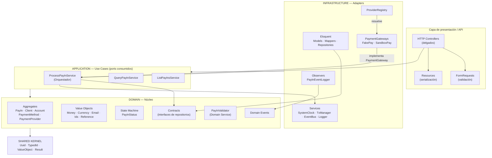
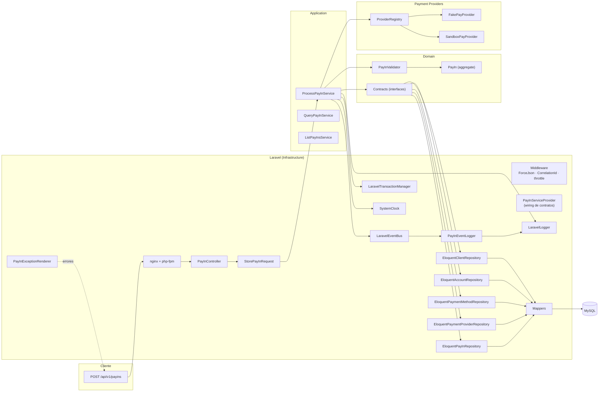
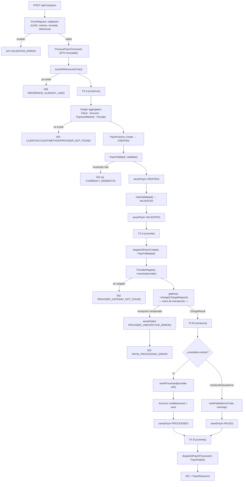
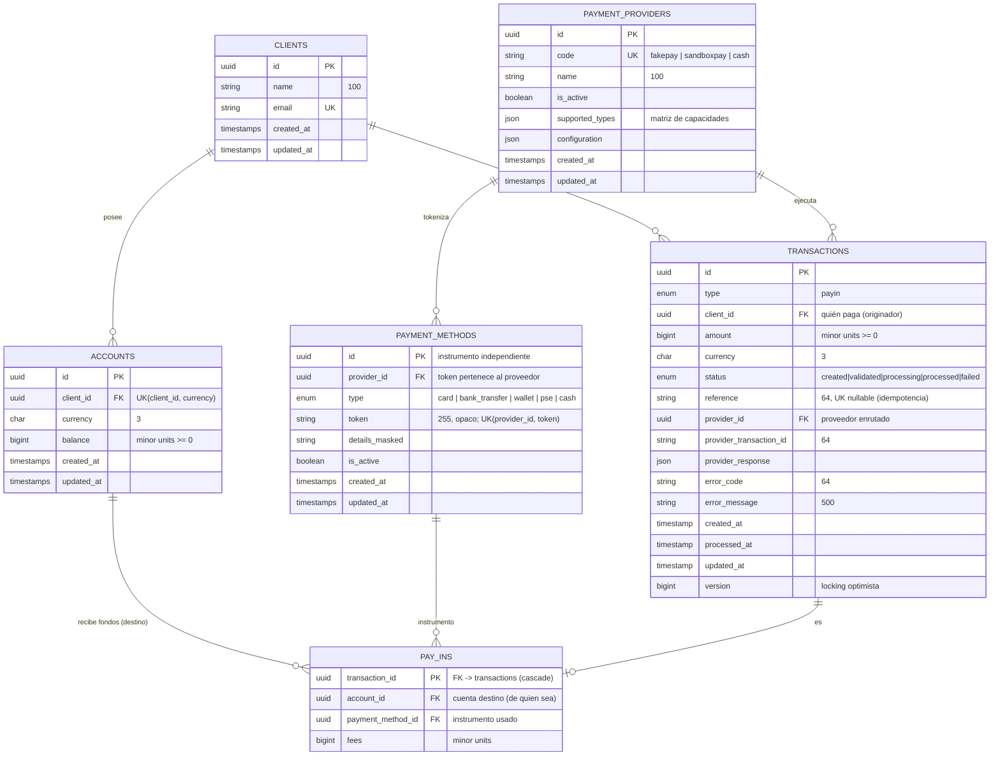
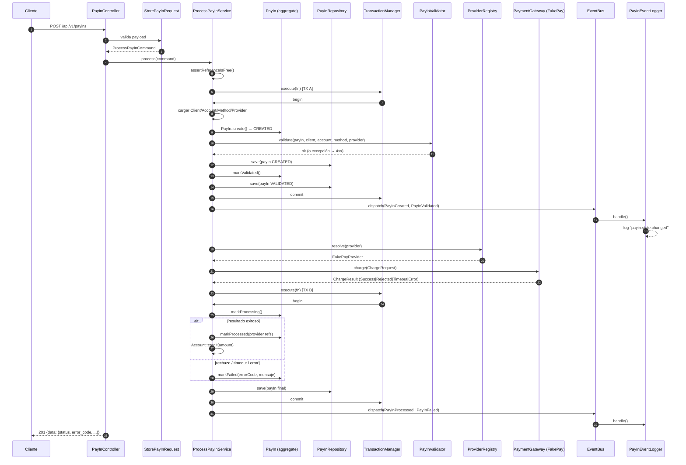

# Documentación de Arquitectura — Componente PayIn

Diagramas técnicos del componente PayIn (Arquitectura Hexagonal, DDD, Laravel 11 como infraestructura).

---

## 1. Arquitectura Hexagonal

## 2. Diagrama de Componentes

## 3. Diagrama de Flujo (Orquestador)

## 4. Modelo Entidad Relación

## 5. Diagrama de Secuencia — Procesamiento PayIn

